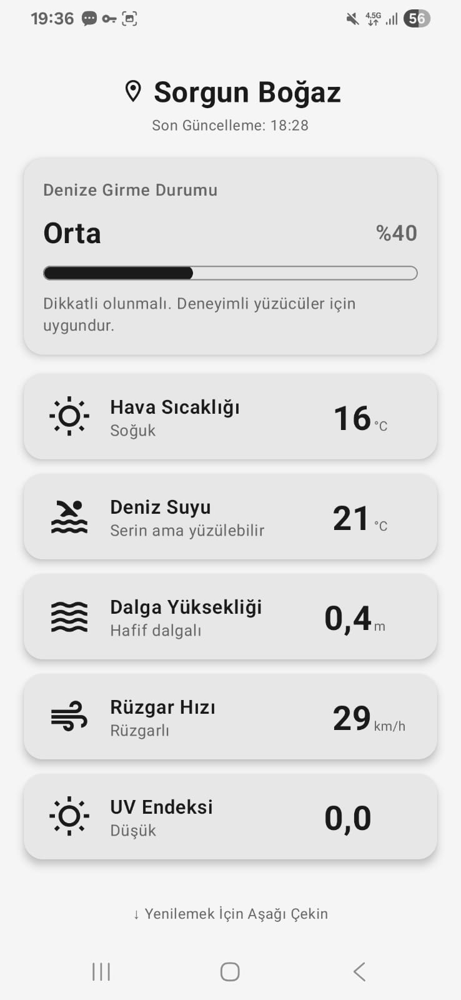

# 🏊 Sorgun Boğaz - Deniz Durumu

Sorgun Boğaz bölgesi için anlık deniz koşullarını gösteren uygulama.

## 🌐 Canlı Demo

👉 **[sorgunbogaz.me](https://sorgunbogaz.me)**

## 📱 Ekran Görüntüsü

## ✨ Özellikler

- **Anlık Veriler** - Hava, deniz suyu, dalga, rüzgar, UV endeksi
- **Akıllı Algoritma** - Denize girme uygunluğunu %0-100 olarak hesaplar
- **Bağlamsal Açıklamalar** - "Serin ama yüzülebilir", "Hafif rüzgarlı" gibi
- **Minimalist Tasarım** - Siyah-beyaz, yaşlı dostu büyük yazılar

## 📊 Denize Girme Algoritması

100 puanlık sistem (her parametre 0-25 puan):

| Puan | Durum | Açıklama |
|------|-------|----------|
| 75+ | 🟢 Mükemmel | İdeal koşullar |
| 60-74 | 🟡 İyi | Uygun, hafif dikkat |
| 35-59 | 🟠 Orta | Deneyimli yüzücüler için |
| 0-34 | 🔴 Uygun Değil | Tehlikeli |

## 🛠️ Teknolojiler

**Android:** Kotlin, Jetpack Compose, Material3, Retrofit

**Web:** Vanilla HTML/CSS/JS, Open-Meteo API

## 📍 Konum

Sabit koordinat: `36.745°N, 31.469°E` (Sorgun Boğaz, Alanya)

## 📥 İndirme

- **Web:** [sorgunbogaz.me](https://sorgunbogaz.me)
- **Android APK:** [Releases](../../releases) sayfasından

## 📄 Lisans

MIT License
